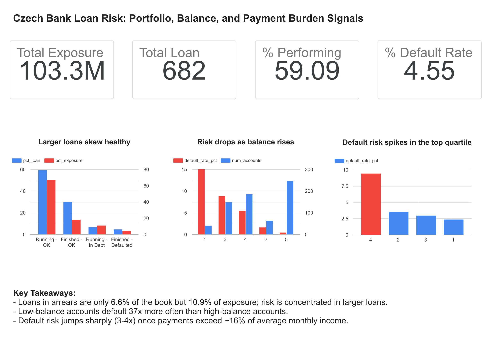

# Bank Loan Credit Risk Analysis (SQL)


**[View the live interactive dashboard](https://datastudio.google.com/s/iMYuc-6D8YA)**

**Where does a bank's loan risk sit, and which early signals separate loans that default from loans that perform?**

A SQL analysis of a real bank's loan portfolio and transaction history (Berka dataset, Czech bank, 1993-1998). 3 business questions, answered with standard SQL (CTEs, window functions, joins, CASE segmentation) in SQLite.

---

## Key findings at a glance

| # | Business question | Finding | Suggested action |
|---|---|---|---|
| 1 | Where is portfolio risk concentrated? | Performing loans are 59.1% of loans and 66.9% of exposure. Loans in arrears (behind on payments) are only 6.6% of loans but 10.9% of exposure. | Monitor large loans first, since arrears skew toward bigger tickets. |
| 2 | Does account balance behavior signal default? | Lowest-balance quintile defaults at 15.0%, versus 0.41% in the highest (~37x gap). | Add average balance as a behavioral early-warning feature. |
| 3 | Does payment burden signal default? | Default jumps from 2.3-3.5% to 9.41% once payment exceeds ~16% of average monthly credits. | Test a simple PTI (payment-to-income) cutoff as an underwriting rule. |

**Takeaway:** balance behavior carries a gradual risk signal, while payment burden carries a threshold signal. They flag different kinds of risk, so a screen using both should catch more than either alone.

---

## Dataset and tools

- **Data:** Berka dataset, an anonymized Czech bank database with 8 related tables (accounts, loans, transactions, clients, and others) and 1M+ transaction records.
- **Source:** [Hugging Face](https://huggingface.co/datasets/yifanmai/czech_bank_qa/tree/main) (`czech_bank.db`), also available as [Kaggle CSVs](https://www.kaggle.com/datasets/marceloventura/the-berka-dataset)
- **Tools:** SQLite, DB Browser for SQLite
- **SQL techniques:** CTEs, window functions (`NTILE`, `SUM() OVER`), joins, `CASE` segmentation, aggregation
- **Loan status codes:** A = Finished-OK, B = Finished-Defaulted, C = Running-OK, D = Running-In Debt (in arrears: still active, but behind on payments).
- **Default definition used:** status B (finished and defaulted)

---

## Q1: Where is risk concentrated in the loan portfolio?

**Business problem:** A portfolio manager needs to know how the bank's money is spread across loan outcomes before deciding where to look more closely.

**Approach:** Group loans by status, then calculate each status's share of loan count and of total loan amount using a window function.

**File:** `q1_portfolio_risk_exposure.sql`

```sql
WITH status_summary AS (
SELECT
status,
COUNT(status) AS loan_count,
SUM(amount) AS loan_exposure
FROM loan
GROUP BY status
),
summary_with_total AS (
SELECT 
status,
loan_count,
loan_exposure,
SUM(loan_count) OVER () AS total_loan_all,
SUM(loan_exposure) OVER () AS total_exposure_all
FROM status_summary
)
SELECT 
status,
CASE
			WHEN status  = 'A' THEN 'Finished - OK'
			WHEN status = 'B' THEN 'Finished - Defaulted'
			WHEN status = 'C' THEN 'Running - OK'
			WHEN status = 'D' THEN 'Running - In Debt'
END AS status_label,
loan_count,
loan_exposure,
ROUND(loan_count * 100.0 / total_loan_all, 2) AS pct_loan,
ROUND(loan_exposure * 100.0 / total_exposure_all, 2) AS pct_exposure
FROM summary_with_total;
```

**Finding:** Running - OK loans make up 59.1% of loans and 66.9% of exposure, so the largest loans skew healthy. Running-In Debt loans / in arrears are only 6.6% of loans but 10.9% of exposure, which means they are larger than average.

**Recommendation:** A small number of large loans carries disproportionate dollar risk if they convert to default. Prioritize monitoring by loan size within the In Debt group.

**Limitation:** Exposure is the original loan amount, not the current outstanding balance.

---

## Q2: Does account balance behavior signal default?

**Business problem:** Credit decisions traditionally lean on application data. Does how a customer's balance behaves in their account add a useful signal on its own?

**Approach:** Calculate each account's average balance across its transaction history, rank accounts into five equal-sized groups (quintiles) with `NTILE`, join to loan outcomes, and compare default rates across groups.

**File:** `q2_balance_default_risk.sql`

```sql
WITH avg_balance AS (
	SELECT
	account_id,
	AVG(balance) AS avg_bal
	FROM trans
	GROUP BY account_id
)
, quintile AS (
	SELECT
	account_id,
	avg_bal,
	NTILE(5) OVER (ORDER BY avg_bal) AS balance_quintile
	FROM avg_balance
)
, loan_outcome AS (
	SELECT
		account_id,
		CASE
		WHEN status = 'B' THEN 1 ELSE 0 END AS is_default
	FROM loan
)
, combined AS (
    SELECT
        q.account_id,
        q.avg_bal,
        q.balance_quintile,
        lo.is_default
    FROM quintile q
    JOIN loan_outcome lo ON q.account_id = lo.account_id
)
SELECT
    balance_quintile,
    COUNT(*) AS num_accounts,
    SUM(is_default) AS num_defaults,
    ROUND(AVG(is_default) * 100.0, 2) AS default_rate_pct
FROM combined
GROUP BY balance_quintile
ORDER BY balance_quintile;
```

**Finding:** The lowest balance quintile defaults at 15%, compared with 0.41% for the highest, a gap of roughly 37x. The pattern is not perfectly smooth (quintile 3 defaults slightly more than quintile 2), but the gap between the extremes is large.

**Recommendation:** Average balance is worth testing as a behavioral early warning feature alongside conventional application data.

**Limitations:**
- Group sizes are uneven (40 loan accounts in quintile 1 versus 246 in quintile 5), so the 15% figure rests on a small sample.
- Average balance is measured over the full transaction history, which can include the period after the loan was issued. A stricter version would use only pre-loan transactions.

---

## Q3: Does payment burden signal default?

**Business problem:** A loan can look fine on size and term and still be unaffordable if its payment takes too large a share of the customer's regular income.

**Approach:** Build a payment-to-income (PTI) ratio: monthly loan payment divided by the account's average monthly credits (used as an income proxy). Split loans into quartiles by that ratio and compare default rates.

**File:** `q3_debtburden_default.sql`

```sql
WITH monthly_credits AS (
    SELECT
        account_id,
        SUBSTR(date, 1, 7) AS year_month,
        SUM(amount)        AS credit_month
    FROM trans
    WHERE type = 'PRIJEM'          --credit transactions
    GROUP BY account_id, year_month
),
avg_credits AS (
    SELECT
        account_id,
        ROUND(AVG(credit_month), 2) AS avg_monthly_credit
    FROM monthly_credits
    GROUP BY account_id
),
loan_ratio AS (
    SELECT
        l.account_id,
        ROUND(l.payments / a.avg_monthly_credit, 2) AS pti_ratio,
        CASE WHEN l.status = 'B' THEN 1 ELSE 0 END  AS is_default
    FROM loan l
    JOIN avg_credits a ON l.account_id = a.account_id
),
ratio_quartile AS (
    SELECT
        account_id,
        pti_ratio,
        NTILE(4) OVER (ORDER BY pti_ratio) AS quartile,
        is_default
    FROM loan_ratio
)
SELECT
    quartile,
    COUNT(*)                          AS num_accounts,
    SUM(is_default)                   AS num_defaults,
    ROUND(AVG(is_default) * 100.0, 2) AS default_rate_pct,
    MIN(pti_ratio)                    AS min_ratio,
    MAX(pti_ratio)                    AS max_ratio
FROM ratio_quartile
GROUP BY quartile
ORDER BY quartile;
```

**Finding:** Loans in the top quartile (PTI ratio of 0.16 or higher) default at 9.41%, compared with a roughly flat 2.3-3.5% across the bottom three quartiles, a 3-4x jump. Unlike balance in Q2, where risk declines gradually, payment burden shows a threshold: risk stays low, then rises sharply past one point.

**Recommendation:** A simple affordability cutoff could work as a first-pass underwriting rule. Validate the 0.16 threshold on more data before using it as a hard limit.

**Limitations:**
- Some top quartile accounts have ratios above 1.0, which may mean income arrives outside the tracked account rather than true unaffordability. Investigate these before setting a cutoff.
- Income is measured over the full account history, not strictly at the time of approval.

---

## Overall conclusions

1. Risk is concentrated in a few larger loans that are already in arrears (Q1).
2. Low average balance is associated with much higher default rates (Q2).
3. Payment burden shows a sharp threshold rather than a gradual slope (Q3).
4. Balance behavior and payment burden capture different kinds of risk, balance behavior and payment burden appear to capture different kinds of risk, so combining them is a natural next test.

## Scope and next steps
**What this analysis shows:** relationships between balance behavior, payment burden and loan outcomes. It is descriptive analysis, which makes it a strong basis for choosing which signals to build into a predictive model.

**Method notes:**
- Some segments are small, so rates are best read as directional, and the largest gaps (balance extremes, top PTI quartile) are the most reliable signals.
- Balance and income are averaged over each account's full history. The next version will use only pre-loan transactions to mirror a real approval decision.

**Next steps:** test a combined screen (balance signal plus PTI flag) on a hold-out set, and build a dashboard for the portfolio view.

## How to reproduce

**Option 1:** Download combined database `czech_bank.db` from [Hugging Face](https://huggingface.co/datasets/yifanmai/czech_bank_qa/tree/main) and directly use it with SQL program.

**Option 2:**
1. Download the CSVs from the [Kaggle mirror](https://www.kaggle.com/datasets/marceloventura/the-berka-dataset).
2. Combine manually CSV files / tables.

Then run queries `q1_portfolio_risk_exposure.sql`, `q2_balance_default_risk.sql` and `q3_debt_burden_default.sql` from this repo on the database.
